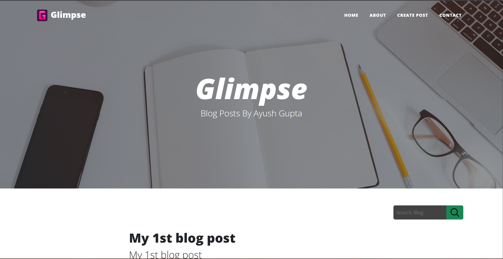
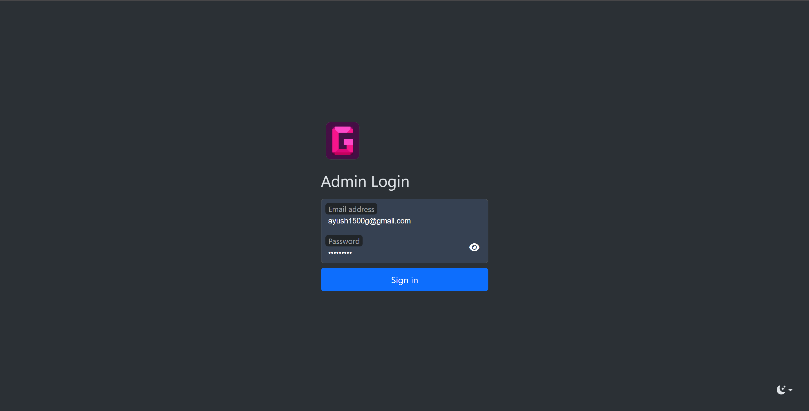
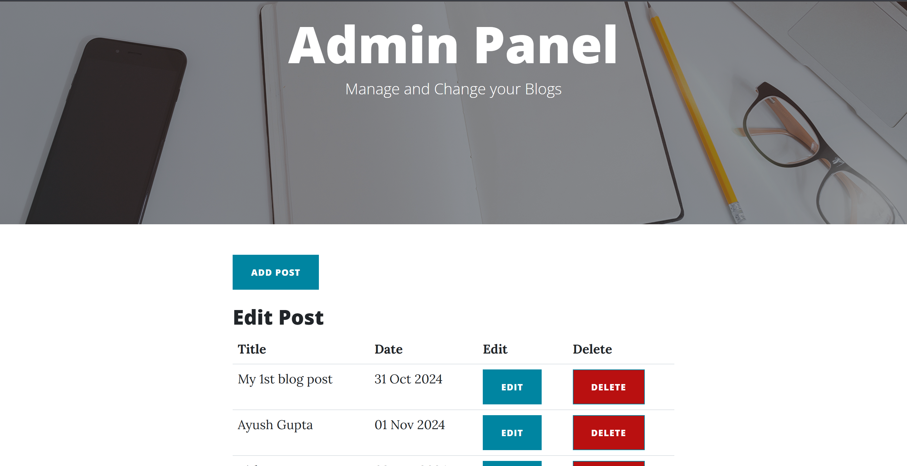

# Glimpse Blog

 Developed Glimpse, a responsive blog platform using Flask and Bootstrap. Designed a secure admin panel with RBAC and full CRUD capabilities, reducing management time by 30%. Implemented blog search functionality (O(n) search, tested with 200+ posts) and a functional contact form
 integrated with Flask-Mail for simulated email delivery.

Home Page

Admin Login

Admin Panel

Contact Form Page
